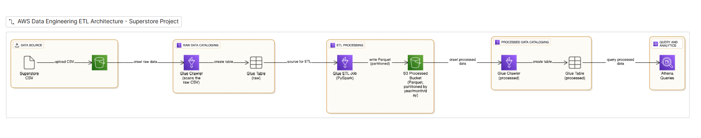
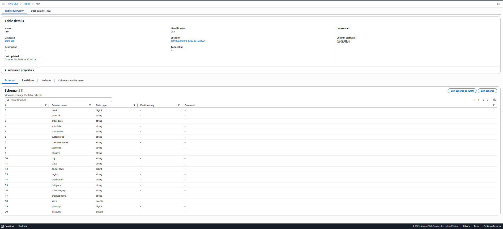
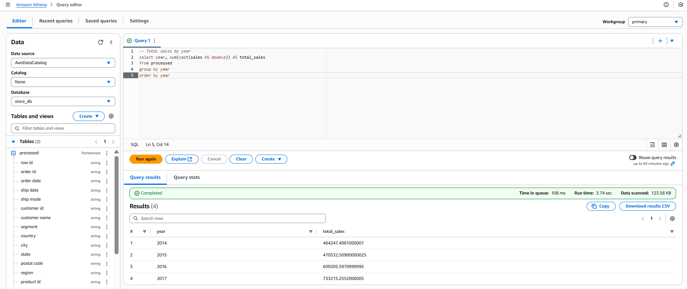
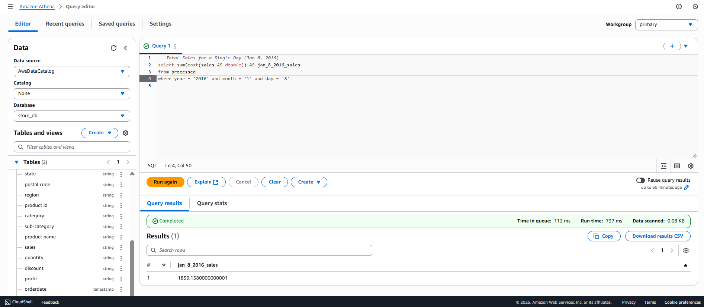

# 🏗️ Superstore AWS ETL Project

*A clean AWS ETL architecture showing data flow from ingestion to analytics.*

## 🚀 Project Overview

This is an end-to-end **AWS Data Engineering project** using the **Superstore dataset**.  
It demonstrates a complete ETL workflow — from raw data ingestion to analytical querying.

### The pipeline includes:
- 📥 Raw CSV ingestion to **Amazon S3**
- ⚙️ ETL processing with **AWS Glue (PySpark)**
- 🧩 Partitioned **Parquet** storage in S3
- 🔍 Querying with **Amazon Athena** for serverless analytics

## 🧰 Tools & Services Used
- **Amazon S3** — Data Lake for raw & processed data  
- **AWS Glue** — Crawlers & ETL Jobs  
- **Amazon Athena** — Query Engine  
- **IAM** — Access & Role Management    

---

## Folder Structure

- `glue-scripts/` → PySpark ETL script  
- `screenshots/` → Screenshots of architecture flow, tables, queries, and results  

---

## 🔄 ETL Pipeline Overview

**Step 1: Raw Data Ingestion**  
📄 CSV uploaded to S3 → `raw/Sample - Superstore.csv`

**Step 2: Glue Crawler (Raw Layer)**  
🧠 Glue Crawler scans raw CSV → creates **raw table** in Data Catalog (schema inferred)

**Step 3: Glue ETL Job (Transformation)**  
- Reads raw CSV  
- Converts `Order Date` → timestamp  
- Adds `year`, `month`, `day` columns  
- Writes **Parquet** → `processed/` partitioned by year/month/day  

**Step 4: Glue Crawler (Processed Layer)**  
- Scans processed Parquet files  
- Creates **processed table** in Data Catalog  
- Auto-detects partitions  

**Step 5: Athena Queries (Analytics Layer)**  
Run Athena SQL queries on processed Parquet data using **partition pruning** for efficiency.
---

## 🖼️ Screenshots

### 1️⃣ Raw Glue Table  
  
*Shows schema automatically inferred by Glue from raw CSV.*

### 2️⃣ Processed Glue Table  
  
*Demonstrates Parquet output with year/month/day partitions.*

### 3️⃣ Athena Query – Aggregate Total Sales by Year  
  
*Shows total sales aggregation by year.*

### 4️⃣ Athena Query – Partition Filter (Year, Month, Day)  
  
*Demonstrates partition-based filtering in Athena.*
---

## Key Learnings
- Efficient ETL on AWS using Glue and PySpark  
- Partitioned Parquet storage reduces data scanned in Athena  
- Serverless analytics with Athena for big datasets  
- End-to-end AWS Data Engineering pipeline  

---

## Notes

- Partitioning helps **query only necessary data**, improving both speed and cost-efficiency.  
- Converting data from **CSV to Parquet** reduces storage size and accelerates Athena queries.  
- AWS Glue Crawlers automatically **infer schema** and create tables in the Data Catalog.  
- The **ETL Job (PySpark)** handles data cleaning, transformation, and Parquet conversion.  
- Using **S3 as a Data Lake** separates raw and processed layers, maintaining clean data organization.  
- **Athena** enables direct SQL querying on S3 data without managing any servers or databases.  
- Proper **IAM roles and permissions** are essential for Glue and Athena to access S3 securely.